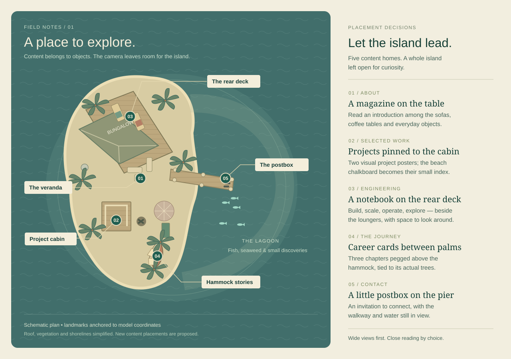

# Island exploration and design decision

## Outcome

The implemented portfolio is a place visitors can explore, with content discovered through small objects. Neighborhood views retain the surrounding furniture, trees, and shoreline. Reading opens explicitly: the camera approaches the selected object, a native reader appears, and closing retraces the approach to the visitor's saved exploration view.

This record combines the original model inspection with the resulting architecture. The observations and measured anchors below informed the placements; they are not a substitute for checking the current views in a browser.



## What was inspected

Inspected the original geometry from the water, rear, west and beach sides; then examined the veranda, rear deck, all sides of the changing cabin, campfire and umbrella, hammock, pier, lagoon, roof, bungalow interior and underside of the pier. A temporary viewer provided free orbit, individual camera presets and mesh identification. Added portfolio documents were excluded from that viewer.

The optimized GLB contains 264 meshes, 44 materials and no animation clips. The inventory includes seven named Nessie figures, thirteen fish meshes and two seagulls. Counts come from the asset inventory; not every small figure was individually visible through its surrounding foliage.

### Area-by-area findings

| Area | Existing features observed | Design implication |
| --- | --- | --- |
| Water-side arrival | Pier points toward the bungalow; beach and hammock flank it; fish and rocks occupy the foreground. | Best orientation view. Show where the paths lead before asking visitors to read. |
| Front veranda | Three sofa pieces, adjoining small coffee tables, magazine, cans, small green figure, towels over railings, bicycle, double doors, windows, torches and colored string lights. | Already feels inhabited. The magazine is a natural introduction, but it is much too small to determine the default camera distance. Keep the furniture and building visible. |
| Rear deck | Two loungers with different towels, two side tables, bottles, pineapple, flip-flops and a small figure beside the bungalow wall. | A substantial second destination, absent from the current tour. Appropriate for a compact notebook/workspace, without replacing the whole deck with a panel. |
| Changing cabin | Roofless wooden enclosure, plank walls, floorboards, towels and flip-flops. Palm trunks and the bungalow constrain the approach. | Two compact project posters can belong on the exterior wall. This is not an existing furnished office or exhibition room. |
| Beach clearing | Burned fire pit, lounger, umbrella with visible supports, open cooler, pineapple and paths/footprint details. | A place to pause and enjoy the environment. Use the fire and lighting as optional atmosphere, rather than inserting another résumé paragraph. |
| Hammock clearing | Fabric hammock tied between two actual palm trunks, rocks, ferns and coconuts. A clear view connects it back to the cabin and beach. | Three short career cards on a rope make sense here. Place the rope above the hammock and attach it to the actual trunks. Preserve the hammock silhouette. |
| Pier | Full plank walkway, upright posts, two sea scooters, flip-flops, perched seagull and fish near the end. | Keep it navigable and visually open. A small postbox/envelope near one post is a stronger contact affordance than a large postcard occupying the walking surface. |
| Lagoon | Fish groups, rocks, seaweed, submerged pineapple and a small yellow object partly obscured by seaweed. | Optional discoveries and subtle life. Keep essential portfolio information on land. Do not turn the water into another text panel. |
| Roof | Satellite dish, perched seagull and scattered leaves. The dish is part of `House_M_DoorsWindowsDetails_0`, not its own separate object. | Useful visual landmark and optional ambient detail. Dish animation would require isolating geometry; rotating the entire material mesh would also move other house details. |
| West / rear shore | Rocks, palms, narrow shoreline, bungalow side walls; the rear deck becomes visible from below the canopy. | Allow visitors to orbit around this side. Avoid treating each empty wall as a space that must be filled. |
| Bungalow interior | Inspection showed bare wall/floor surfaces; no furnished interior was found. | Do not promise an interior workspace without deliberately building one. Exterior destinations already provide enough room. |
| Below pier / island | Support posts, underside of water/ground surfaces and the exposed edge of the diorama. | This view exposes construction rather than a finished underwater world. Clamp normal exploration above the ground/water boundary. |

### Useful spatial anchors

World coordinates in the current model, in `[x, y, z]` order. These are placement references, not finished camera poses.

| Object / region | Anchor |
| --- | --- |
| Veranda magazine | `[-1.029, 3.098, 0.081]` |
| Veranda table group | `[-0.839, 2.923, -0.257]` |
| Rear deck tables | `[-3.838, 2.923, -8.059]` and `[-1.210, 2.923, -6.634]` |
| Cabin exterior wall | `[-4.329, 3.756, 4.849]` |
| Existing chalkboard face | `[-4.179, 3.115, 8.162]` |
| Fire pit | `[-0.962, 2.428, 5.011]` |
| Hammock center | `[0.759, 3.382, 8.927]` |
| Candidate rope attachments | `[1.253, 4.8, 7.374]` and `[0.508, 4.8, 10.484]` |
| Pier center | `[6.026, 1.731, 0.271]` |
| Fish near end of pier | Around `[9.0, 1.6, 1.8]` |
| Satellite dish surface hit | `[-7.422, 5.659, -1.080]` |

The model has baked vertex positions and a scaled parent hierarchy. Added motion must use local pivots derived from world bounds, rather than rotating whole meshes about the scene origin.

## What the previous implementation taught us

The retired scroll tour combined smooth wheel input with a second camera-damping layer, held still through parts of each interval, and gave journeys of very different lengths the same scroll distance. Worse, fitting text on a roughly 30-centimeter magazine controlled the entire camera pose. It produced mandatory macro views and abrupt orientation changes.

During inspection at 718 × 773, a route from the overview entered foliage and filled the screen with a leaf. “View surroundings” only widened the lens; it did not provide exploration. Those findings led to direct orbit, neighborhood destinations, model-aware route checks, and separate reading views.

## Implemented content placements

Each location gets a distinct purpose. Essential content remains directly accessible from navigation and the text edition; discoveries are optional.

| Content | Physical home | What visitors see / do |
| --- | --- | --- |
| Introduction | Existing magazine on the veranda table | A printed cover fits the two existing page faces. Select it or “Open the magazine” to approach the actual pages, align the print, and reveal the introduction reader. |
| Selected projects | Two pinned mini-posters on the changing-cabin exterior | One each for FitNyx and the segmentation research, with titles and compact diagrams. Each opens its corresponding project tab. The existing chalkboard is a short index that navigates to the cabin. |
| Skills / engineering | Open technical notebook on a fitted rear-deck table tray | A measured 35 × 19.5 cm tray fits the far half of a 45 cm table beside its bottle. The open notebook and four colored tabs lead to Build, Scale, Operate, and Explore in the reader; both loungers remain visible. |
| Career / education | Three pegged cards on a rope above the hammock | DTU → internship → senior engineer. Cards show dates and short summaries; selecting one opens the matching full career record. Rope and pegs connect them to the measured palm attachments. |
| Current role | Small pinned note on one bungalow door leaf | A short current-role note opens the senior-engineer record. The door retains its proportions and handle. |
| Contact | Small weathered postbox and envelope beside a pier post | A postbox fitted to an outer pier post holds an envelope. Selecting it opens the contact letter; Email and LinkedIn are deliberate link actions. |
| Systems at scale | Tide log on the lagoon pier | A compact printed field log turns the otherwise quiet lagoon into a work artifact: 60,000+ ONDC merchants, ~3,000 metro transactions/day at launch, and the Go → Kafka → Redis path. Select the glowing invitation or “Open the tide log” for a camera approach and readable commerce/metro field notes. |
| Infrastructure | Field board on the west-facing bungalow wall | A weathered board below the satellite dish names Go, Kafka, Kubernetes and Prometheus, with the sourced 30–40% infrastructure-cost reduction after the catalog rebuild. Its glowing invitation and “Read the field board” action open the infrastructure story after a guarded camera approach. |

### Implemented ambient details

- Existing fish follow short, slow local routes; the lagoon itself stays stationary.
- Palm crowns now respond to a quiet procedural wind field. Each authored `_M_PalmTreeLeaves_0` mesh receives its own local pivot, phase, speed and tiny cross-axis sway, so gusts travel through the canopy instead of synchronizing every tree. Trunks and shared leaf atlases remain untouched.
- Daylight has its own visual language: warmer hemispheric fill deepens the model, a soft sun halo gives the sky a focal point, and sparse drifting motes plus water glints add life without competing with physical artifacts. Dusk replaces those cues with fireflies, torch tips and ember light.
- The hammock rotates gently around its measured attachment axis, and the pegged career cards move slightly.
- Existing seagulls make occasional small turns around their feet.
- Dusk changes the lighting and string-light emission, adding small torch-tip and campfire ember accents.
- Seven existing Nessie figures form an optional discovery trail with a count and hover feedback. Portfolio content never depends on finding them.
- Both original ferns near the chalkboard remain, with the previously measured small offsets on the model clone.

All ambient motion stops under system reduced motion or the Still setting and pauses while the page is hidden or a reader is open. There are no authored animation clips: local pivots and accumulated active time provide procedural movement without changing cached source resources.

**Known texture limitation:** the original plant, palm-leaf, and torch atlases (`M_Plants`, `M_PalmTreeLeaves`, `M_Torch`) are RGB images without alpha. Their optimized counterparts retain this limitation. Opaque leaf/flame cards can remain visible at close angles; `alphaTest` cannot reconstruct absent transparency. An authored alpha mask or corrected source atlas is required. The implementation does not delete foliage or guess a color-key mask.

## Implemented navigation and camera

On the first reveal after LoadingScreen, the camera descends from above a temporary cloud layer to the responsive overview in 3.5 seconds. The route uses the existing guard and quintic easing; its initial pose is prepared beneath the loader. The welcome name fades in letter by letter during descent. Any pointer, touch, click, wheel, or keyboard input settles the camera at the overview and reveals the complete heading. Reduced motion, Still, repeat visits in the same session, and unavailable safe routes skip the arrival. The cloud layer is removed afterward, and normal section navigation owns the camera again.

Scroll down advances through the eight sections and wraps from the final west shore back to the overview; scroll up from the overview wraps to the west shore. The loop uses the same model-aware route guard and eased camera flight as every other section change, so the return to the home composition feels like another leg of the walk. A deliberate gesture advances once and consumes its momentum tail. A new gesture can change the destination during travel, so scrolling is not locked until the camera arrives. Previous/next buttons are always available and follow the same loop. The island map and named navigation select neighborhoods, and “Whole island” restores orientation.

Drag or one-finger movement orbits; pinch and the explicit plus/minus buttons adjust bounded zoom. `IslandControls.tsx` owns both direct OrbitControls input and navigation travel. It has one motion controller, stable world-up, short exploration damping, and no panning. Inertia is cleared before flights, reading, and collision rollback. Dragging interrupts a flight from its current position without clamping close views outward. Browser-height changes adjust the lens without restarting travel or resetting an explored view. Focused-canvas keyboard controls are `PageDown` / `PageUp` for sections, arrows to orbit, `+` / `-` to zoom, and `Home` for the overview. The shell handles wheel input before OrbitControls; readers and the phone's expanded place list retain native scrolling and cannot trigger section changes.

On phones, previous/next controls remain along a transparent footer. Sound, lighting, and motion settings live in a header disclosure; map destinations use a named list with 44px touch targets. Rendering uses antialiasing at DPR 1, fewer ambient particles, frozen local matrices for static model nodes, and no per-frame floating-label occlusion queries. Touch and pressed-pointer moves skip hover raycasts while preserving physical-object taps. These changes reduce avoidable rendering and interaction work; actual frame rate remains device-dependent.

Area poses, targets, zoom ranges, and orbit arcs live in `island-data.ts`; portrait framing adjusts field of view and distance. Reader dimensions do not determine physical object scale or neighborhood framing. `artifact-camera.ts` supplies a close-reading pose for each object, derived from its actual surface. The shared camera sequence blocks scene interaction throughout approach, reading, and return. `ArtifactReader.tsx` opens a native dialog and retains normal internal scrolling; after closing, the camera and DOM focus return to their saved state. `FieldGuide.tsx` and `/read` provide the complete portfolio.

### Model-aware guard

`camera-path.ts` copies selected static surfaces from the loaded model into an owned world-space BVH, including the house, changing cabin, pier, terrain, rocks, bushes, and foliage groups. This accelerates triangle queries without modifying the displayed model or shared GLTF indices. A clear direct corridor is preferred. Otherwise, inner and outer rings at several heights provide alternatives near the shore, below the canopy, or above it. Route selection includes heading changes to discourage hairpin turns. Each corner uses a local quadratic curve with matching entry and exit directions; curves shrink locally when clearance is tight. Offset rays and cross-section probes check their sampled segments. There is no sharp-polyline fallback. When no route is available, a brief fade changes the view instead of crossing geometry.

Orbit movement is rejected when its endpoint/segment is obstructed or the camera passes below y=2.9. These checks protect the camera position, not its complete view frustum. The guard is not a physics engine; additional geometry and every possible orbit pose still require review.

### Inspection views that established useful compositions

These historical study angles established the useful compositions. The current responsive, guarded destinations are defined in `app/components/island-data.ts`:

| View | Position | Look-at |
| --- | --- | --- |
| Water-side orientation | `[25, 11, 4]` | `[0, 2, 0]` |
| Veranda context | `[3.7, 5, 4.2]` | `[-1, 3.3, -0.6]` |
| Rear-deck furniture | `[-1, 4.8, -10.2]` | `[-2, 3.1, -6.9]` |
| Beach objects | `[4, 4.5, 7]` | `[0, 2.8, 4.6]` |
| Pier and lagoon | `[12, 6, 6]` | `[6, 2.3, 0.2]` |

## Checks and acceptance

The code is organized around `island-data.ts`, `IslandControls.tsx`, `camera-path.ts`, `WorldArtifacts.tsx`, `LivingIsland.tsx`, and the accessible reading components. The former scroll track and document-fitting camera controller are retired.

Run from the project directory:

```sh
npm run lint
npx tsc --noEmit
node scripts/check-section-scroll.cjs
node scripts/check-artifact-cameras.cjs
node scripts/check-island-navigation.cjs
npm run build
```

The scroll script checks wheel momentum, reversal, pixel/line/page units, modifiers, horizontal input, and reader suspension. The navigation script loads the optimized model's geometry without a browser. It checks authored endpoints at 1280 × 720, 390 × 844, 320 × 640, and 718 × 500, then checks all 288 ordered area routes. Its independent samples are denser than the routing probes. Its output records clearance and direction-continuity samples, fade fallbacks, failures, and calculation timings. It does not test all user orbit positions, rendered framing, focus, touch input, or performance.

Browser acceptance remains necessary:

1. Visit every map destination on desktop and narrow portrait. Keep the intended object and enough surroundings visible, especially the rear deck, hammock, and west shore.
2. Interrupt travel with a drag. Test orbit/zoom limits near walls, trunks, and foliage; restore the overview in one action.
3. Open every artifact, including both posters, the four notebook tabs, and all three career cards. Close by button and Escape; verify the camera pose and DOM focus return.
4. Use the canvas keyboard controls, native dialog focus containment, and tab arrows/Home/End. Wheel and touch inside readers must not move the island.
5. Exercise reduced motion/Still, daylight/dusk, default-on sound (starts on first interaction), hidden-tab return, and loading/error fallbacks. Check `/read` independently of WebGL.
6. Inspect resource use on a lower-powered device. Confirm motion pauses when it should; note the RGB atlas limitation separately from navigation failures.

A successful build or geometry check is not visual acceptance. Record the checks actually completed for a change and any remaining limitations.


### Earlier browser verification — 23 September 2026

Checked the running local application at 1280 × 720, 390 × 844, and 320 × 640. The inspection covered every desktop destination, portrait veranda/deck/hammock/cabin framing, and narrow-screen project and career readers. The deck camera was moved below the foreground canopy after visual review. The short-phone welcome now gives the island its own space.

Verified direct drag orbit, the then-current wheel zoom, keyboard Home, interrupted travel, tour previous/next, Still mode including a mid-flight toggle, daylight/dusk redraw in Still mode, and opt-in audio toggling. Wheel zoom and the optional tour were subsequently replaced by section scrolling and permanent previous/next controls on 24 September. Native readers retained camera position; Escape restored focus to the object button; project/engineering tabs and reader scrolling worked. The standalone `/read` route and full field guide opened successfully. No browser console errors were recorded in this pass.

These were desktop-browser viewport tests. Physical phone pinch gestures, low-power GPU performance, and simulated network/WebGL failures were not exercised in this pass. The original RGB foliage limitation remains visible at some close viewing angles.

### Final validation — 23 September 2026

- Production build, lint, and TypeScript validation pass.
- All 288 ordered area routes pass across four viewport sizes: 76,309 clearance samples, zero blocked samples, zero fade fallbacks.
- 512 seeded rays agree with Three.js’s original mesh raycaster.
- Local Node timings: collision structure setup 13.4 ms; route median 0.5 ms, p95 1.4 ms, maximum 2.1 ms. These are route-calculation timings on this machine, not browser frame-rate or phone benchmarks.
- Final keyboard review added an explicitly focusable reading region and preserved Ctrl/Meta browser zoom shortcuts while the canvas is focused.

### Scrolling and camera corrections — 24 September 2026

The user confirmed that up/down scrolling should move through portfolio sections. Wheel navigation now advances or reverses a section, including during an existing flight; trackpad momentum does not skip through the remaining areas. Zoom is available through explicit controls, keyboard, and pinch. The separate tour mode is removed, and previous/next controls remain visible.

The veranda camera now sits inside the seating area at `[-1.7, 4.4, 1.8]`, looking toward `[-1, 3.25, -0.1]`. The original magazine is unobstructed on the coffee table, with the sofa, armchair, cans, and small figure around it. The rear-deck camera at `[1.25, 4.6, -7.5]` looks toward `[-1.8, 3.15, -6.6]`, showing the notebook and both loungers below the canopy. Marker labels stay clear of screen edges and fixed controls; their physical objects remain selectable.

Routes now use inner shoreline connections and heading costs to reduce detours and reversals. Local curved corners preserve their entry/exit directions, replacing the earlier sharp-path fallback. All 288 ordered routes pass: 78,686 clearance samples, 19,824 direction-continuity samples, maximum sampled turn 1 degree, zero blocked samples, and zero fade fallbacks. All 512 reference rays agree with the original mesh raycaster. Local calculation times were 13.2 ms for setup, 1.4 ms median per route, 4.3 ms p95, and 7.7 ms maximum; these are not frame-rate measurements.

Six wheel-input regression scenarios pass. Browser checks covered forward scrolling through every area, reverse scrolling, retargeting during travel, desktop and portrait magazine/notebook framing, Page Up/Page Down, Still mode, and explicit zoom. Notebook content scrolled normally while the active area stayed on the rear deck, and Escape restored the reading button's focus. At 320 × 640, the magazine reader also scrolled normally and restored focus to its physical-object label. Compact controls fit without wrapping their decorative footer title. No application errors appeared in the console; the installed Three.js/R3F combination emits a Clock deprecation warning. Production compilation, lint, and TypeScript validation pass. Physical phone gestures and lower-power GPU performance still require device testing.

### Magazine handoff — 24 September 2026

Opening the magazine is a two-part interaction. The camera follows a checked route from the veranda neighborhood to the measured coffee-table page plane, interpolating its field of view and up vector so the printed text becomes upright in the world. Only after the camera arrives does the native reading dialog appear, with a short paper-scale reveal. Escape or “Back to area” dismisses the paper transition first, then the camera returns to the veranda pose and restores focus to the original invitation.

`magazine-camera.ts` uses the existing two page faces and their measured quaternion instead of inventing a billboard pose. The helper test checks all four supported viewport sizes: every page corner remains visible and unobstructed, text stays upright, 40 page sightlines clear the original model, and 296 samples pass on the approach and return routes. The measured close-up fills 61.4% of the frame height at 1280 × 720 and 51.1–55.3% on the tested narrow portrait sizes. Reduced-motion mode keeps the same final composition and skips the animated travel/reveal.
